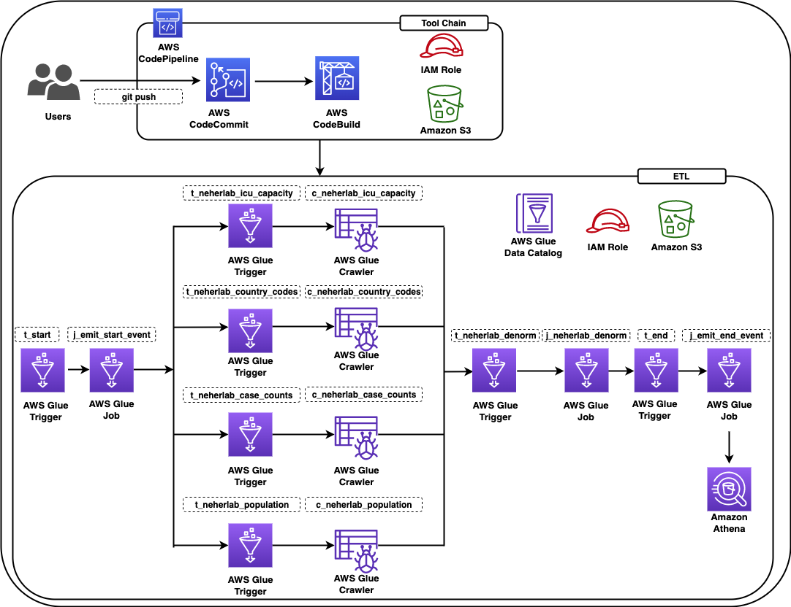
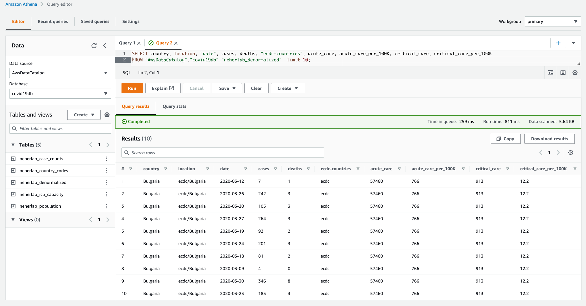

# Build, Test, and Deploy AWS Glue workflows using AWS CDK based CI/CD pipelines

### About The Project

This repository demonstrates building a Continuous Integration and Continuous Delivery (CICD) pipeline using AWS CodeCommit, AWS CodeBuild and AWS CodePipeline to provision AWS Glue based data pipelines using AWS Cloud Development Kit (CDK). 

Please refer to the accompanying post [Build, Test, and Deploy AWS Glue workflows using AWS CDK based CI/CD pipelines](https://aws.amazon.com/blogs/big-data/build-test-and-deploy-aws-glue-workflows-using-aws-cdk-based-cicd-pipelines/) for additional information.

### Solution Overview

The AWS CDK based solution deploys a CI/CD pipeline using AWS CodeCommit, AWS CodeBuild and AWS CodePipeline, executes [docker based PyTests](https://aws.amazon.com/blogs/big-data/develop-and-test-aws-glue-version-3-0-jobs-locally-using-a-docker-container/) and deploys a data pipeline using AWS Glue. The data pipeline consists of AWS Glue Workflow, Triggers, Jobs and Crawlers. The  data pipeline uses [COVID-19 Harmonized Data](https://registry.opendata.aws/talend-covid19/) managed by [Talend / Stitch](https://www.stitchdata.com/) to construct a data pipeline.

### Architecture Diagram

The diagram shows the various components of the solution:

 


### Prerequisites

- An AWS account
- The [AWS Command Line Interface](http://aws.amazon.com/cli) (AWS CLI) [installed](https://docs.aws.amazon.com/cli/latest/userguide/getting-started-install.html)
- The [GIT Command Line Interface](https://github.com/git-guides) (GIT CLI) [installed](https://github.com/git-guides/install-git)
- The [AWS CDK Toolkit (cdk command) installed](https://docs.aws.amazon.com/cdk/v2/guide/cli.html)
- [Python 3](https://www.python.org/downloads/) installed
- Permissions to create AWS resources


### Getting Started

Please follow the below instructions to deploy the solution in your AWS account: 


#### Download the source code [aws-glue-cdk-cicd](https://github.com/aws-samples/aws-glue-cdk-cicd)

```
$ git clone git@github.com:aws-samples/aws-glue-cdk-cicd.git
```

#### Create virtualenv:

```
$ cd aws-glue-cdk-cicd
$ python3 -m venv .venv
```

####  On MacOS and Linux, activate the virtual environment:

```
$ source .venv/bin/activate
```

####  On Windows platform, activate the virtualenv:

```
% .venv\Scripts\activate.bat
```

#### Install required dependencies:

```bash
$ pip install -r requirements.txt
```

#### Bootstrap CDK app:

```bash
$ cdk bootstrap 
```

The above command will create the below CloudFormation stack:

- CDKToolkit.

#### Synthesize CloudFormation template:

```bash
$ cdk synth  # optional if not default (-c stage=default)
```

#### Deploy CodePipeline:

```bash
$ cdk deploy  # optional if not default (-c stage=default)
```

The above command will create the below CloudFormation stack:

- cdk-covid19-glue-stack-pipeline
- cdk-covid19-glue-stack

#### Staring AWS Glue Covid19 Workflow

```bash
$ aws glue start-workflow-run --name Covid_19
 ```

#### Query the tables using AWS Athena:

<kbd></kbd>

### Cleanup

Log into the AWS console, select the appropriate region, navigate to the AWS CloudFormation console , and select and click Delete on the following stacks:

- cdk-covid19-glue-stack-pipeline
- cdk-covid19-glue-stack 
- CDKToolkit.

Log into the AWS console, select the appropriate region, navigate to the AWS S3 console and delete the associated S3 buckets:

- cdk-covid19-glue-stack-p-pipelineartifactsbucketa-`*`
- cdk-`*`-assets-`<AWS_ACCOUNT_ID>`-`<AWS_REGION>`
- covid19-glue-config-`<AWS_ACCOUNT_ID>`-`<AWS_REGION>`
- neherlab-denormalized-dataset-`<AWS_ACCOUNT_ID>`-`<AWS_REGION>`

## Interested in Contributing?

See [CONTRIBUTING](CONTRIBUTING.md#security-issue-notifications) for more information.

## License

This library is licensed under the MIT-0 License. See the [LICENSE](/LICENSE) file.
