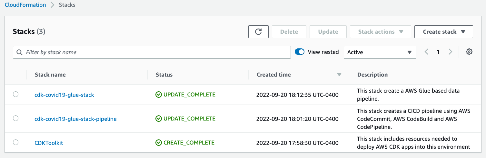
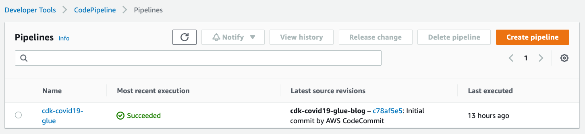
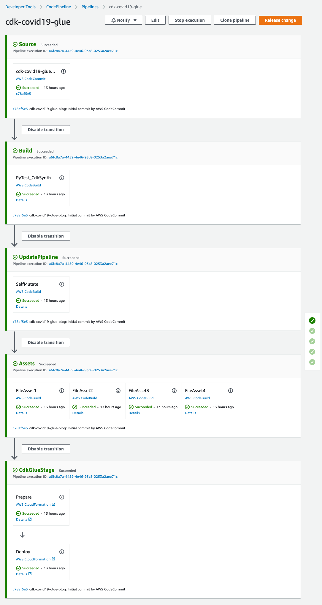
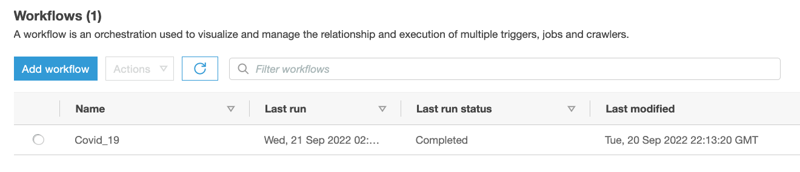
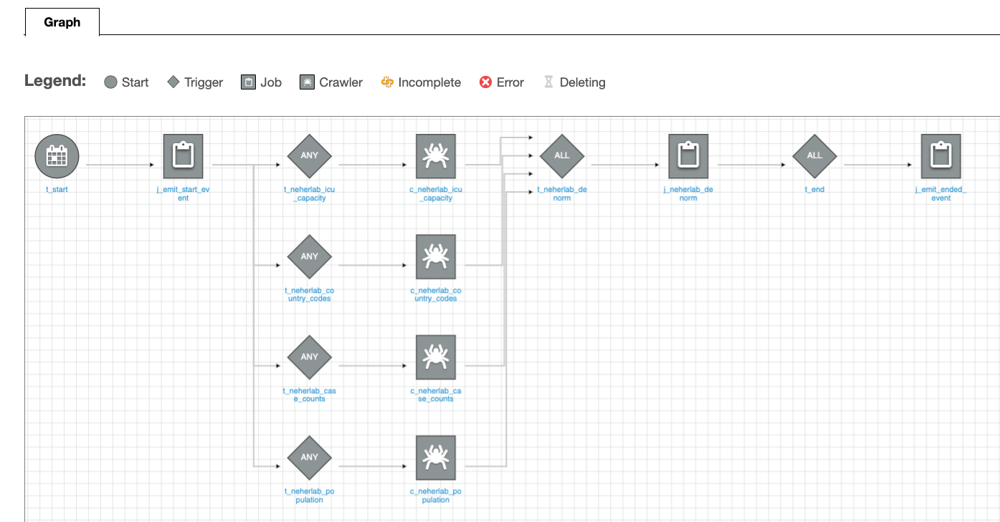
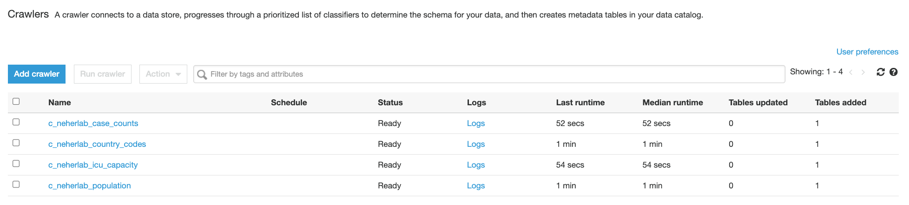
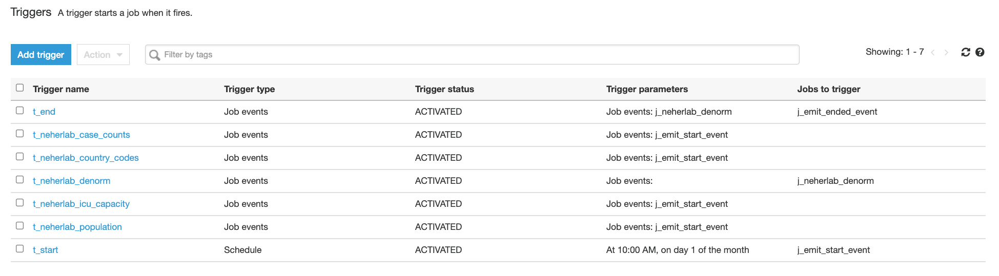
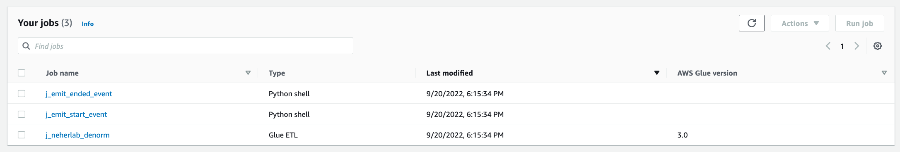
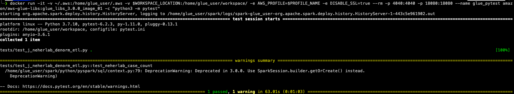

### Folder Structure

| Folder/File | Description                                                                                                                                         |  
| :-------------------------|:--------------------------------------------------------------------------------------------------------------------------------------|
| config/dev.yaml | This is a directory where the Profile of environment are stored. dev.yaml is the configuration file for a dev instance of AWS Account           |
| cdk.json | This file tells the CDK Toolkit how to execute your app                                                                                                |
| src | Holds the Glue ETL script for the denormalisation logic for Neherlab project                                                                                |
| tests | Holds the Glue test scripts                                                                                                                               |
| cdkglueblog | This directory contains the CDK code for creating the whole Glue Stack for Covid19 Application as per the config                                    |
| pipelineStack | This directory contains the CDK code for creating the CodePipeline and which in turn deploys the Glue Stack per the config                        |
| app.py | This is the entry point for the CDK application and intiates the CDK stacks mentioned in this file                                                       |
| requirment.txt | Contains the list of the all the dependencies that need to be installed CDK application                                                          |
| setup.py | Defines how this Python package would be constructed and its dependencies                                                                              |

At the time of publishing of this project, AWS CDK has two versions of Glue modules available. The modules are [@aws-cdk/aws-glue](https://docs.aws.amazon.com/cdk/api/v1/docs/aws-glue-readme.html) module and [@aws-cdk/aws-glue-alpha](https://docs.aws.amazon.com/cdk/api/v2/docs/aws-glue-alpha-readme.html). The alpha module is a higher-level construct and provides multiple advantages. However, at this time the module is still in experimental stage. Hence, we have used the stable  @aws-cdk/aws-glue module. 

### ETL Scripts

| ETL File | Job Description |  
| :-------------------------| :-------------------------------------------------------------------------------------------------------------------|
| src/j_emit_start_event.py | This is a python jobs that starts the workflow and creates the event |
| src/j_neherlab_denorm.py | Spark ETL for transform and create a denormalised view by stiching all the base data together in a parquet format|
| src/j_emit_ended_event.py | This is a python jobs that ends the workflow and creates the specific event|

### Athena Tables

| Table Name | Description | Dataset Location | Access | Location |  
| ---------- | ----------- | ---------------- | ------ | -------- |
| neherlab_case_counts   | Total number of cases               | s3://covid19-harmonized-dataset/covid19tos3/neherlab_case_counts/   | Read       | Public              |
| neherlab_country_codes | Country code                        | s3://covid19-harmonized-dataset/covid19tos3/neherlab_country_codes/ | Read       | Public              |
| neherlab_icu_capacity  | Intensive Care Unit (ICU) capacity  | s3://covid19-harmonized-dataset/covid19tos3/neherlab_icu_capacity/  | Read       | Public              |
| neherlab_population    | Population                          | s3://covid19-harmonized-dataset/covid19tos3/neherlab_population/    | Read       | Public              |
| neherla_denormalized   | Denormalized table                  | s3://your-S3-bucket-name/neherla_denormalized                       | Read/Write | Readers AWS Account |

## Screenshots

Below images shows the artifacts created by `cdk deploy` step.

#### CloudFormation Stack for CodePipeline

 

#### CodePipeline Stages

The `CdkGlueStage` stage of the CodePipeline will deploy a Glue Stack `cdk-covid19-glue-stack`.

 

 

#### Application Workflow

 

 

#### Glue Crawlers

<kbd></kbd>

#### Glue Triggers

<kbd></kbd>

### Glue ETL Scripts

Below jobs will be created in the Glue Jobs console
<kbd></kbd>

### Develop and Test AWS Glue Jobs Locally
Please refer to [Developing and testing AWS Glue job scripts locally](https://docs.aws.amazon.com/glue/latest/dg/aws-glue-programming-etl-libraries.html) for additional infromation.

<kbd></kbd>
